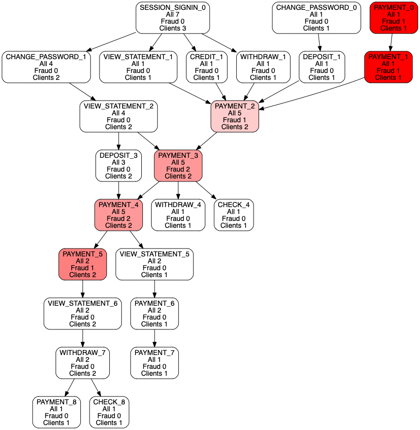

# Make_graph_from_dataframe
Example how convert data from pandas dataframe to networkx graph and show in dot_graph format 

This jupyter notebook convert some clients actions (for example look to dataset.csv) into dot graph format

## From this 
```
Number;clients;type;time;resolution_flg
1;CL1;SESSION_SIGNIN;2020-10-05 16:30:34;
2;CL1;CHANGE_PASSWORD;2020-10-05 16:30:34;
3;CL1;VIEW_STATEMENT;2020-10-05 16:30:34;
4;CL1;DEPOSIT;2020-10-05 16:30:34;
5;CL1;PAYMENT;2020-10-05 16:30:34;F
6;CL1;PAYMENT;2020-10-05 16:30:34;F
7;CL1;VIEW_STATEMENT;2020-10-05 16:30:34;
8;CL1;WITHDRAW;2020-10-05 16:30:34;
9;CL1;PAYMENT;2020-10-05 16:30:34;
10;CL2;SESSION_SIGNIN;2020-10-06 16:30:34;
11;CL2;VIEW_STATEMENT;2020-10-06 16:30:34;
...
```
## To THIS


